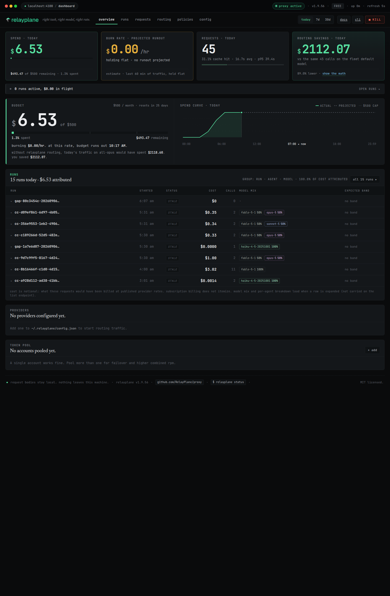

# RelayPlane

**Know what every agent run costs. Kill the runaway before it drains your budget.**

A local proxy that sits between your AI agents and their model providers,
prices every request as it happens, rolls the cost up per run and per agent,
and lets you cap or kill spend before a loop turns into a bill.

[](https://www.npmjs.com/package/@relayplane/proxy)
[](https://github.com/RelayPlane/proxy/blob/main/LICENSE)
[](https://www.npmjs.com/package/@relayplane/proxy)



RelayPlane runs on your machine and is a drop-in replacement for the Anthropic
and OpenAI base URLs: no Docker, no Python, no account, and nothing leaves your
machine unless you turn it on. It is for people running multi-agent or fan-out
workloads who cannot tell which run ate the bill. MIT licensed, no paid tiers,
the whole product is in this repo.

## Quick start (30 seconds)

```bash
npm install -g @relayplane/proxy
relayplane start
```

Point Claude Code (or any tool that speaks the Anthropic or OpenAI API) at it:

```bash
export ANTHROPIC_BASE_URL=http://localhost:4100
claude
```

That is the whole setup. Open http://localhost:4100 for the live dashboard, or
run `relayplane watch` for a cost ticker in your terminal. Using API keys
instead of a Claude subscription? `relayplane init` walks you through it.
Full walkthrough: [relayplane.com/docs/quickstart](https://relayplane.com/docs/quickstart).

## What you get

- **Live cost intelligence.** Every request priced as it happens and rolled up
  per run, per agent, and per model, in a local dashboard and a terminal
  ticker. No SDK, no code changes.
  [Runs and attribution](https://relayplane.com/docs/runs) ·
  [Telemetry](https://relayplane.com/docs/telemetry)
- **Model routing.** Send simple work to cheap models and hard work to frontier
  models by complexity tier, on by default. The classifier is authoritative and
  routes **down**: a simple request goes to a cheaper model even if your agent
  named an expensive one, so you never have to hand-set a default model. Force a
  specific model per request with the `X-RelayPlane-Bypass: true` header (or
  `neverDowngrade` policy). It is a config edit that hot-reloads, never a code
  change.
  [Routing](https://relayplane.com/docs/concepts/routing)
- **Budget caps.** Hard limits (daily, hourly, per-request, per-session, and
  per-run) that block, downgrade, or warn. A per-run cap 429s that one job
  instead of stopping the whole machine.
  [Budget caps](https://relayplane.com/docs/budget-cap)
- **Kill switch.** One command or one button halts all routed traffic
  instantly, with an audit trail of what was stopped and what it saved.
  [Cost caps and kill switch](https://relayplane.com/docs/cost-caps)
- **Anomaly detection.** Opt-in detectors flag token-explosion loops, velocity
  spikes, and repetition (a stuck agent looping the same call) and alert you
  before the caps have to.
  [Cost caps and kill switch](https://relayplane.com/docs/cost-caps)
- **Failover.** On a `429`/`503`/`529` (rate limit, overload, or cap),
  RelayPlane cools the provider down and, when 2+ provider keys are present,
  automatically remaps the model and retries on the next provider instead of
  failing your run. Cross-provider fallback auto-enables with no config and uses
  whatever provider keys you have; opt out with
  `crossProviderCascade.enabled=false`. Non-streaming path today; streaming is a
  planned follow-up.
  [Providers](https://relayplane.com/docs/providers)
- **Providers.** Native drop-in forwarding for Anthropic, OpenAI, Google
  (Gemini), xAI, OpenRouter, and local Ollama, all behind one base URL.
  [Providers](https://relayplane.com/docs/providers)
- **Local and private by default.** Passthrough is the default: your
  credentials and traffic stay yours. Per-request telemetry is off unless you
  turn it on.
  [Privacy](docs/privacy.md)

## Runs

Tag work at dispatch time and the proxy rolls cost up by run, agent, and thread.
No SDK, no instrumentation, nothing inside your agent:

```bash
relayplane run --label nightly-backfill -- ./orchestrate.sh
relayplane runs list --days 7
```

Claude Code forwards custom headers byte for byte, so a `.claude/settings.json`
is enough:

```json
{ "env": {
  "ANTHROPIC_BASE_URL": "http://localhost:4100",
  "ANTHROPIC_CUSTOM_HEADERS": "X-RelayPlane-Run: my-run\nX-RelayPlane-Agent: coder"
} }
```

Every `claude -p` already lands in an inferred `cc-<session>` run with no setup
at all.

| Request header | Meaning |
|---|---|
| `X-RelayPlane-Run` | Run id, 128 chars max; a `/` nests it under a parent |
| `X-RelayPlane-Agent` | Agent label, 64 chars (alias: `x-agent-id`) |
| `X-RelayPlane-Run-Label` | Human name, 80 chars; expected-cost bands key off this |
| `X-RelayPlane-Tags` | `k:v,k:v`, up to 10 pairs |
| `X-RelayPlane-Attempt` | Retry attempt number, 1 to 999 |
| `X-RelayPlane-Run-Cap-Usd` | Per-run hard cap, in USD |

Set an expected-cost band per label and the proxy tells you when today's run is
not like the others. Set a per-run cap and it 429s that one job. Retries are
counted apart from first attempts, so you can see how much of a run was rework.
Every figure is notional list price for the traffic, never an invoice, and the
ledger is SQLite on your machine.
Full reference: [relayplane.com/docs/runs](https://relayplane.com/docs/runs).

## Why we built it (and how we know it works)

We run an autonomous engineering pipeline that ships real code every day, and
all of its traffic goes through RelayPlane. Over the last four months that is
thousands of pipeline runs a day, routed, priced, and guarded by this proxy.

The payoff is the swap seam. When we wanted to test a cheaper model on our
heaviest tier, we changed one field, watched the live cost pane, and reverted
nine hours later when the numbers said no:

```jsonc
// ~/.relayplane/config.json, one field, hot-reloaded, no code change
"routing": {
  "mode": "complexity",
  "complexity": {
    "complex": { "provider": "anthropic", "model": "claude-sonnet-5" }
  }
}
```

If you run agents seriously, this is the control you are missing: one pane for
spend, one seam for swapping models, one place to say "never spend more than
this."

## How it compares

| | RelayPlane | claude-code-router | LiteLLM | OpenRouter |
|---|---|---|---|---|
| Runs locally | yes | yes | yes | no (cloud) |
| Anthropic API compatible | yes | yes | partial | no |
| Live per-agent cost pane | yes | per-request estimates | budgets (platform teams) | dashboard (cloud) |
| Spend guardrails (caps, anomaly, kill) | yes | no | budgets | no |
| Free / open source | MIT, everything | MIT | OSS + paid enterprise | 5.5% fee |

Different tools for different jobs: LiteLLM is built for platform teams,
OpenRouter is a hosted marketplace, claude-code-router focuses on multi-agent
orchestration. RelayPlane is the local cost-and-control pane for people who run
agents on their own machine.

## Docs

- [Quickstart](https://relayplane.com/docs/quickstart)
- [Runs and attribution](https://relayplane.com/docs/runs)
- [Routing](https://relayplane.com/docs/concepts/routing) and [Semantic routing](https://relayplane.com/docs/semantic-routing)
- [Budget caps](https://relayplane.com/docs/budget-cap) and [Cost caps and kill switch](https://relayplane.com/docs/cost-caps)
- [Providers](https://relayplane.com/docs/providers)
- [CLI reference](https://relayplane.com/docs/cli) ([repo copy](docs/cli.md))
- [Configuration reference](docs/configuration.md) (routing, cascade, budgets, anomaly detection, cache, credential pool)
- [Claude Code integration](docs/claude-code.md) (auto-start hook, passthrough details)
- [Changelog](https://github.com/RelayPlane/proxy/releases)

## Privacy

Passthrough by default: RelayPlane forwards your own credentials and does not
modify your traffic unless you turn routing on. Per-request telemetry is off by
default. The optional Osmosis mesh (anonymized routing signals shared across
users) is off until you turn it on with `relayplane mesh on`. Full details in
[docs/privacy.md](docs/privacy.md).

## License

MIT. No paid tiers. Everything in this repo is the whole product.
</content>
</invoke>
